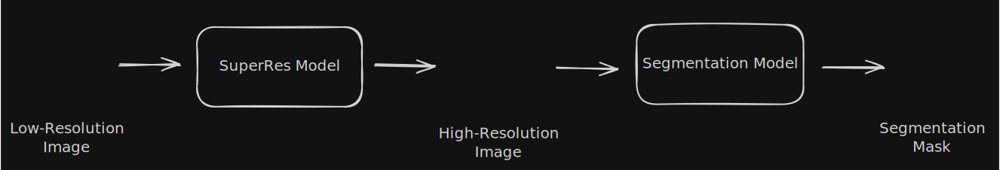

# Deep Learning Pipeline for Brain MRI: Super-Resolution & Segmentation

A systematic benchmark of six Super-Resolution integration strategies
for brain MRI segmentation, applied to Multiple Sclerosis and Parkinson's datasets.

*Developed by [Jesús Santos Barba](https://www.linkedin.com/in/jesús-santos-215706315) as part of my Final Degree Project at the University of Malaga.*

## Overview
The task of segmenting brain lesions in MRI scans is typically constrained by scanner resolution; blurry images make lesion boundaries harder to delineate accurately.  

This project benchmarks six pipeline configurations that combine Super-Resolution and Segmentation in different ways, from fully frozen pretrained networks to jointly trained end-to-end architectures. The goal is to determine which integration strategy yields the best segmentation quality on low-resolution inputs, using Multiple Sclerosis and Parkinson's disease datasets. 

Architectures used: **RCAN** (Super-Resolution, custom implementation) and **UNet** (Segmentation, via `segmentation-models-pytorch`)

## Pipeline configurations
| # | Configuration | SR weights | Seg weights | Loss |
|---|--------------|-----------|------------|------|
| 1 | Seg only (baseline) | — | pretrained, frozen | Seg |
| 2 | SR → Seg (both frozen) | pretrained, frozen | pretrained, frozen | — |
| 3 | SR → Seg (seg trainable) | pretrained, frozen | trainable | Seg |
| 4 | SR → Seg (SR trainable) | trainable | pretrained, frozen | Seg |
| 5 | SR → Seg end-to-end | trainable | trainable | Seg only |
| 6 | SR → Seg joint loss | trainable | trainable | SR + Seg |

An image that represents the pipeline structure is shown below (Note that this image is a general representation that does not represents the combinations):

*General pipeline structure*

Below is an input image that would be fed to the model (i.e. low-resolution image):

And below are the ground truth output segmentation mask and predicted mask:

## Results
We can see the results obtained by the experiments in the table shown below:

[table]

## Experiment design
### Phase 1 — Baseline
This is the basic experiment. From this phase we assess whether introducing a Super-Resolution → Segmentation pipeline improves performance over a standalone segmentation model.

The dataset is downsampled using a deterministic method (bicubic interpolation) applied to both images and masks, resulting in tuples of the form: (LR image, LR mask, HR image, HR mask).

- *Segmentation only*: A segmentation model is trained directly on the low-resolution dataset, producing low-resolution segmentation masks.

- *SR → Seg (both frozen)*: A two-stage pipeline is constructed using pretrained SR and Segmentation networks, both kept frozen. The SR model upsamples the low-resolution input; from this, the Segmentation model produces a high-resolution mask. Predicted masks are downsampled via bicubic interpolation for comparison with the first baseline.

### Phase 2 — Fine-tuning strategies
This phase explores different training configurations to improve upon the baseline results.

- *Frozen SR → trainable Seg*: The SR network is pretrained and kept frozen, while the segmentation network is trained on the SR outputs.
- *Trainable SR, frozen Seg*: The SR network is trained while the pretrained segmentation model remains frozen.
- *End-to-end*: Both SR and segmentation networks are trained jointly as a single model. Optimization is driven solely by the segmentation loss.
- *Joint loss*: Both networks are trained jointly using a composite loss. An SR reconstruction loss on the high-resolution output and a segmentation loss on the predicted mask, combined as a mean of the two losses.

## Setup

## Acknowledgements 
This project is the Final Degree Project (TFG) for the [University of Malaga (UMA)](https://www.uma.es), supervised by the professors Rafael Marcos Luque Baena and Karl Thurnhofer Hemsi.